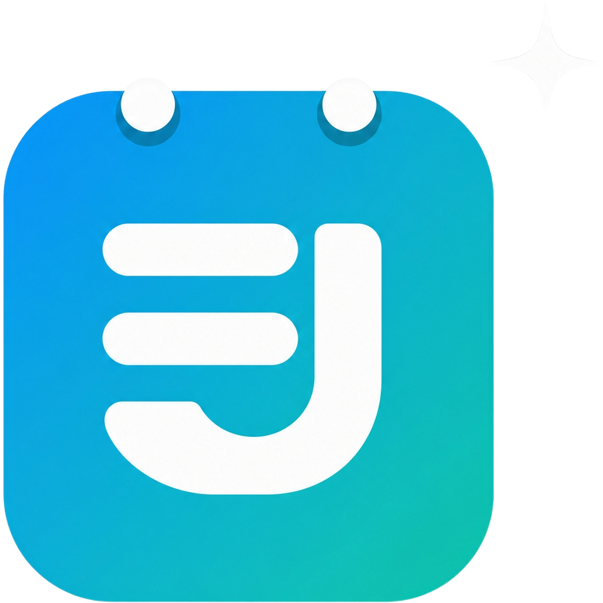
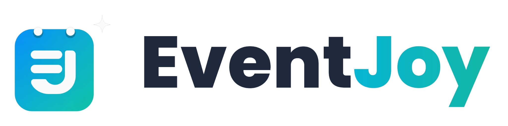

# 🎯 EventJoy — Vector SVG Files

> **Important note**: These SVG files use **embedded PNG** (base64-encoded) from the approved master logo.
> This guarantees **pixel-perfect consistency** with all other brand assets.
>
> If you need a "true vector" (path-based) SVG for advanced editing, please vectorize the
> master logo using Adobe Illustrator or [Vectorizer.AI](https://vectorizer.ai).

## Files

| File | Use case |
|------|----------|
| `eventjoy_icon.svg` | Standalone icon only (calendar with EJ monogram) |
| `eventjoy_logo_full.svg` | Icon + wordmark (light mode, dark text) |
| `eventjoy_logo_full_dark.svg` | Icon + wordmark (dark mode, white text) |

## Usage in HTML

```html


```

All SVGs have **transparent backgrounds** and scale cleanly to any size.
